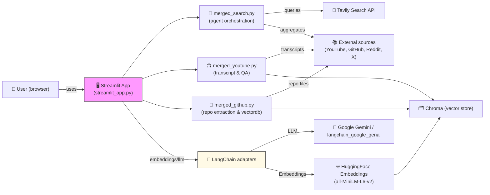

# SearchSphere -  Multi-Source Generative AI Research Assistant

SearchSphere is a lightweight Python toolkit and Streamlit app that aggregates and analyzes information from multiple sources (YouTube, GitHub, Reddit, Twitter/X) using LangChain, Google Gemini, and Tavily search.

## Table of Contents

- [Overview](#overview)
- [Features](#features)
- [Tech Stack](#tech-stack)
- [Installation](#installation)
- [Quick Start](#quick-start)
- [Usage Examples](#usage-examples)
- [Configuration](#configuration)
- [Project Structure](#project-structure)
- [API Reference (auto-detected)](#api-reference-auto-detected)
- [Testing](#testing)
- [Deployment](#deployment)
- [Contributing](#contributing)
- [Security](#security)
- [Performance & Scalability](#performance--scalability)
- [FAQ / Links](#faq--links)

## Overview

SearchSphere is a lightweight Python toolkit and Streamlit app that aggregates and analyzes information from multiple sources (YouTube, GitHub, Reddit, Twitter/X) using LangChain, Google Gemini, and Tavily search. The project provides:

- an interactive Streamlit UI for multi-source research and Q&A
- modular modules to extract and vectorize GitHub repositories and YouTube transcripts
- an agent-based multi-source search connector that queries Tavily and aggregates results

TODO: Add project goals, intended audience, and maintained-by information.

## Features

- Multi-source search across YouTube, GitHub, Reddit, and Twitter/X (see `merged_search.py`).
- YouTube transcript extraction and question-answering (see `merged_youtube.py`).
- GitHub repository extraction, language-aware chunking, and vector store creation (see `merged_github.py`).
- Streamlit-based interactive UI with three main tools: Web Search, YouTube Analysis, GitHub Analysis (`streamlit_app.py`).

## Tech Stack

- Language: Python
- UI: Streamlit
- LLM integration: LangChain adapters and `langchain_google_genai` (Google Gemini)
- Embeddings: HuggingFace Embeddings (`all-MiniLM-L6-v2` used in app)
- Vector DB: Chroma
- Search: Tavily client
- Utilities: BeautifulSoup (`bs4`), `pytube`, `cssutils`

Dependencies are listed in `requirements.txt`.

## Installation

1. Clone the repository.
2. Create and activate a Python virtual environment (recommended).
3. Install dependencies:

```bash
python -m pip install -r requirements.txt
```

4. Create environment variables for API keys (see Configuration section).

## Quick Start

Run the Streamlit interface locally:

```bash
streamlit run streamlit_app.py
```

Open the URL shown by Streamlit in your browser.

## Usage Examples

1) Basic Streamlit run (above).

2) Programmatic usage (examples based on detected modules):

Search agent
```python
from merged_search import search

agent = search(gemini_api="<YOUR_GOOGLE_KEY>", tavily_api="<YOUR_TAVILY_KEY>")
results = agent.output_agent_executor("machine learning basics")
print(results.get("final_answer"))
```

YouTube
```python
from merged_youtube import YouTube

# `embed` and `llm` are embedding/LLM objects (see `streamlit_app.py` for initialization)
yt = YouTube(embed=embed, llm=llm)
yt.extract("https://www.youtube.com/watch?v=...")
answer = yt.answer("What are the main topics?")
```

GitHub repository analysis
```python
from merged_github import GitHubRepo

# instantiate with `embed`, `llm`, and `prompt` objects
repo = GitHubRepo(embed=embed, llm=llm, prompt=prompt, access_token="<GITHUB_PAT>")
vectordbs = repo.extract("https://github.com/user/repo")
response = repo.answer("Where is the database configured?")
```

## Configuration

Environment variables and configuration detected in the codebase:

- `GOOGLE_API_KEY` — used as the Google / Gemini API key (also set in `streamlit_app.py` when missing).
- `GRPC_VERBOSITY`, `GRPC_TRACE` — used to control gRPC logging in the app.
- `TAVILY_API_KEY` (referred via `tavily_api` parameter) — Tavily client API key.
- `GITHUB_ACCESS_TOKEN` or GitHub PAT — used by `GithubFileLoader` to load repository files.

Security note: `streamlit_app.py` contains a hard-coded API key fallback. Rotate any embedded secrets and prefer environment variables in production. TODO: remove hard-coded keys.

## Project Structure

- [LICENSE](LICENSE) — project license (MIT).
- [README.md](README.md) — this file.
- `streamlit_app.py` — Streamlit application and UI wiring (entrypoint).
- `merged_search.py` — agent that queries Tavily (YouTube, GitHub, Reddit, Twitter/X) and aggregates results.
- `merged_youtube.py` — YouTube transcript loader, chunker, and Q&A wrapper.
- `merged_github.py` — GitHub repository loader, language-specific chunking, and Chroma vector store construction.
- `requirements.txt` — Python dependencies.

Note: Local helper scripts used for diagnostics are intentionally gitignored and not part of the published repository — see [.gitignore](.gitignore).

**Live Demo:** 🚀 Visit the deployed app at https://searchsynthesis.streamlit.app/ to try the interface live.

## Architecture Diagram

The high-level system architecture is shown below. It highlights the Streamlit UI, the main extraction/agent modules, and the external services used (Google Gemini, Tavily, HuggingFace embeddings, GitHub, YouTube, and Chroma vector store).



Icons: the README uses emojis to add visual flair to sections and components.

## API Reference (auto-detected)

This project does not expose an HTTP API; instead it provides Python classes and methods. Detected public APIs:

- `search(gemini_api: str, tavily_api: str)`
	- method: `output_agent_executor(input_text: str) -> dict`
	- returns a dictionary with keys: `query`, `final_answer`, `youtube`, `github`, `reddit`, `twitter`. Each source entry contains the search tool outputs (lists of result dicts).

- `YouTube(embed, llm)`
	- method: `extract(link: str) -> str` — loads transcripts and builds a Chroma vector store; raises `ValueError` if no transcript found.
	- method: `answer(query: str) -> str` — returns an LLM response using retrieved transcript context.

- `GitHubRepo(embed, llm, prompt, access_token: str)`
	- method: `extract(link: str) -> dict` — loads files from a GitHub repo, chunks by language, and returns a map of Chroma vector stores per language.
	- method: `answer(query: str) -> str` — runs similarity search across created vectordbs and returns an LLM answer via provided `prompt`.

TODO: Add full input/output schemas and example payloads for each method.

## Testing

No automated tests were detected in the repository. Recommended actions:

- Add unit tests for `merged_search`, `merged_youtube`, and `merged_github` behaviors.
- Add a CI workflow to run tests. TODO: Create `tests/` and CI config.

## Deployment

The application is a Streamlit app. Basic deployment options:

- Run locally: `streamlit run streamlit_app.py`.
- Streamlit Community Cloud or a containerized deployment are viable production options.

TODO: Add step-by-step deploy instructions for Streamlit Cloud, Docker, and cloud providers.

## Contributing

Contributions are welcome. Summary:

- Open issues for bugs or feature requests.
- Fork, branch from `main`, implement changes, and submit a PR.
- Follow conventional commit messages and include tests where applicable.

TODO: Add `CONTRIBUTING.md` with branching strategy, commit conventions, PR checklist, and code review guidelines.

## Security

- License: MIT (see [LICENSE](LICENSE)).
- Report vulnerabilities via the repository's issue tracker or the maintainer contact. TODO: add responsible-disclosure contact.
- Perform dependency scanning on `requirements.txt` before production deployments.

## Performance & Scalability

- The project uses in-memory Chroma collections per run; for larger repositories or high-traffic production uses, a managed vector store or persistent Chroma backend is recommended.
- Embeddings and LLM inference are the main cost/latency drivers; consider batching, caching, and cheaper embedding models for scale.

## FAQ / Links

- Issues & support: TODO — link to issue template and support channel.
- Contributing: TODO — link to `CONTRIBUTING.md`.
- Changelog: TODO — add `CHANGELOG.md`.

---

TODOs:

- Add tests and CI
- Remove hard-coded API keys and document required secrets
- Add contributing, changelog, and deployment instructions
